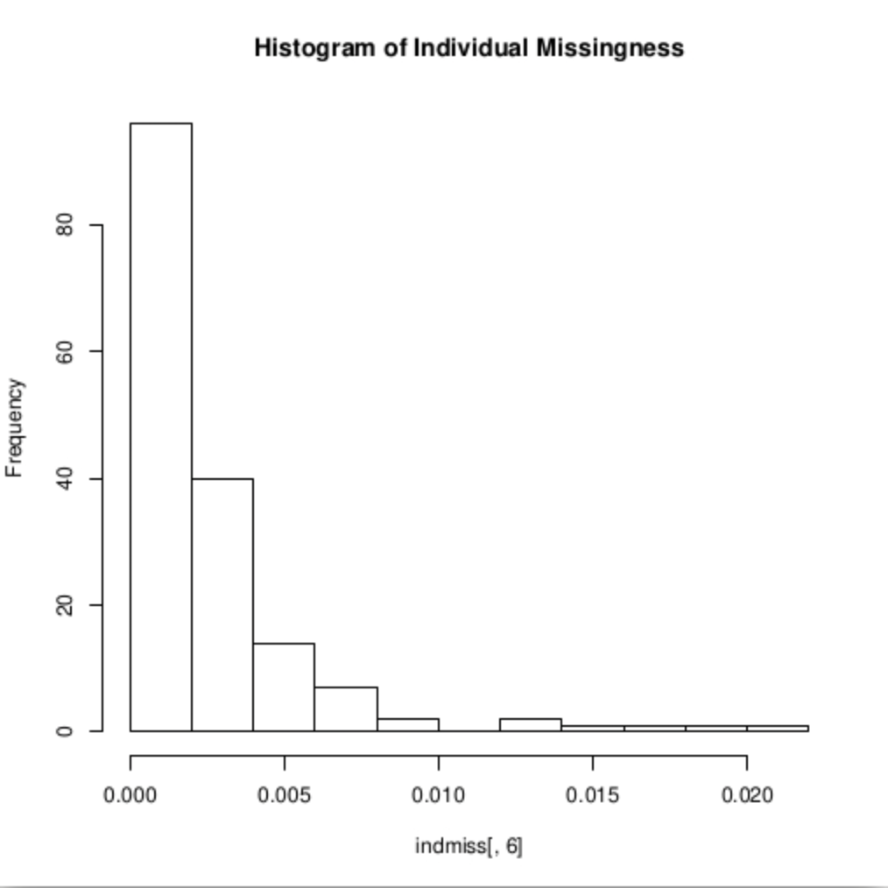
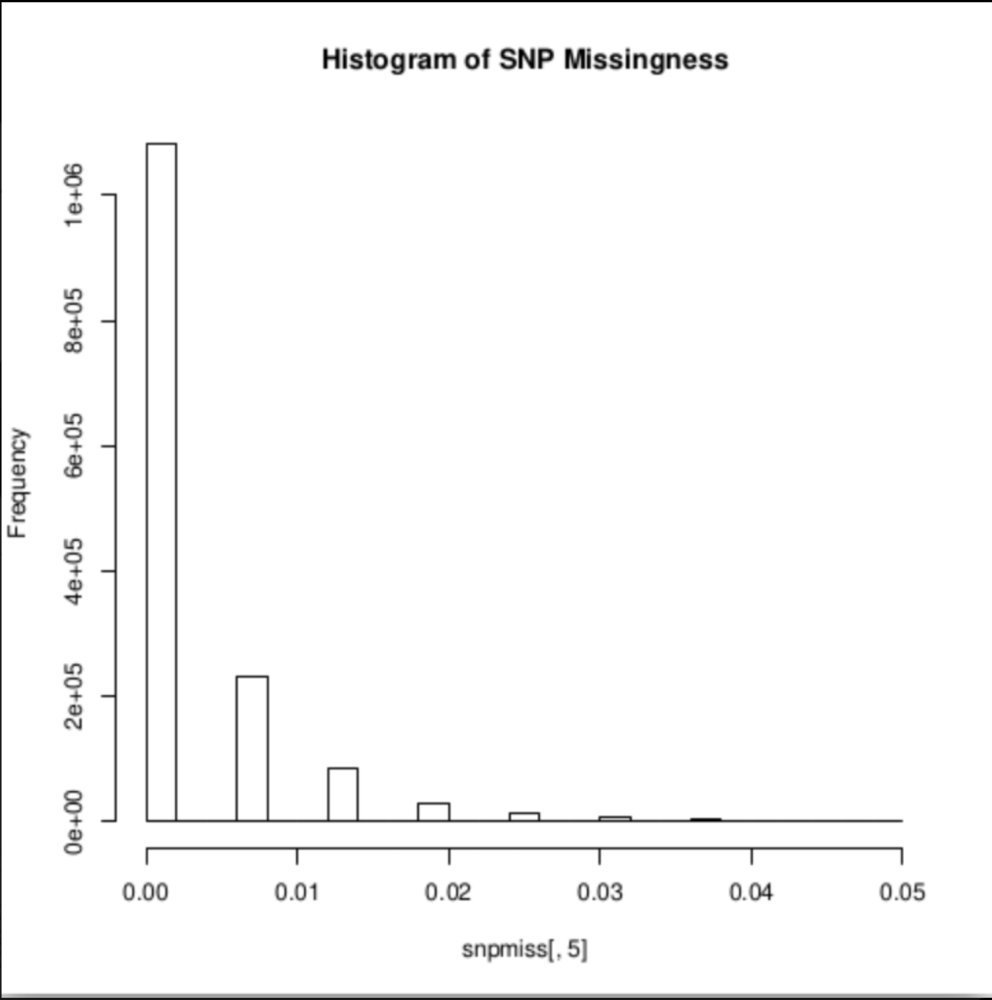
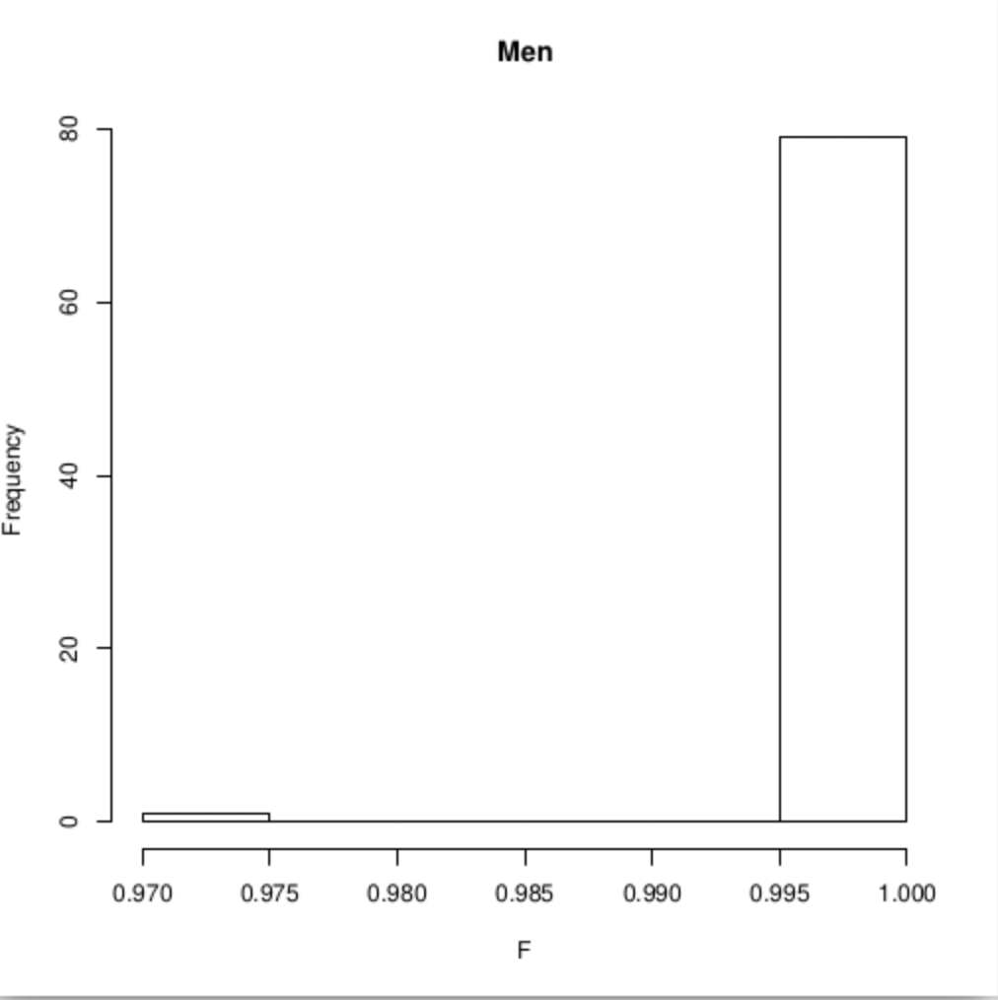
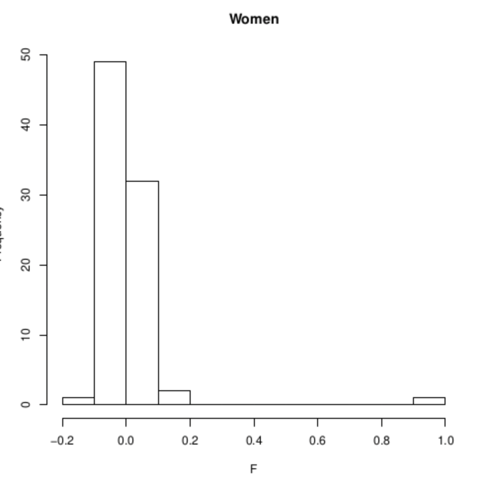
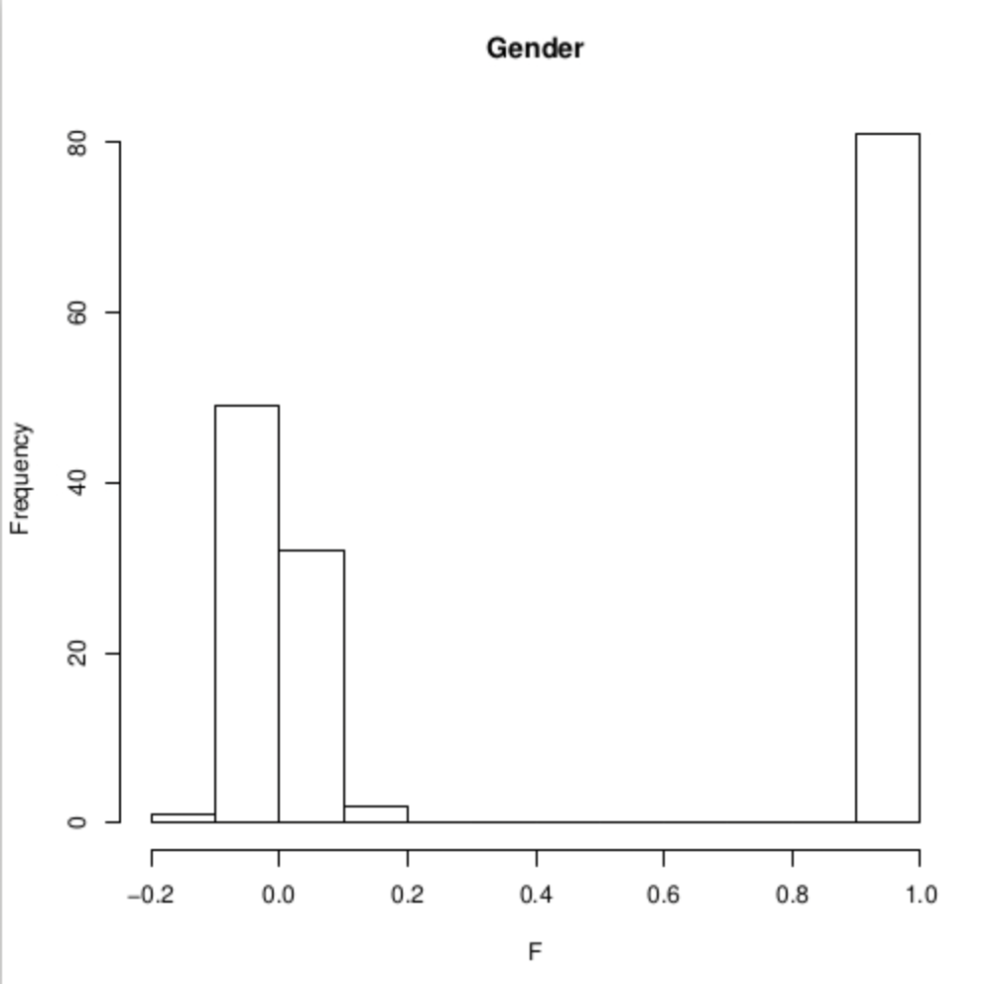
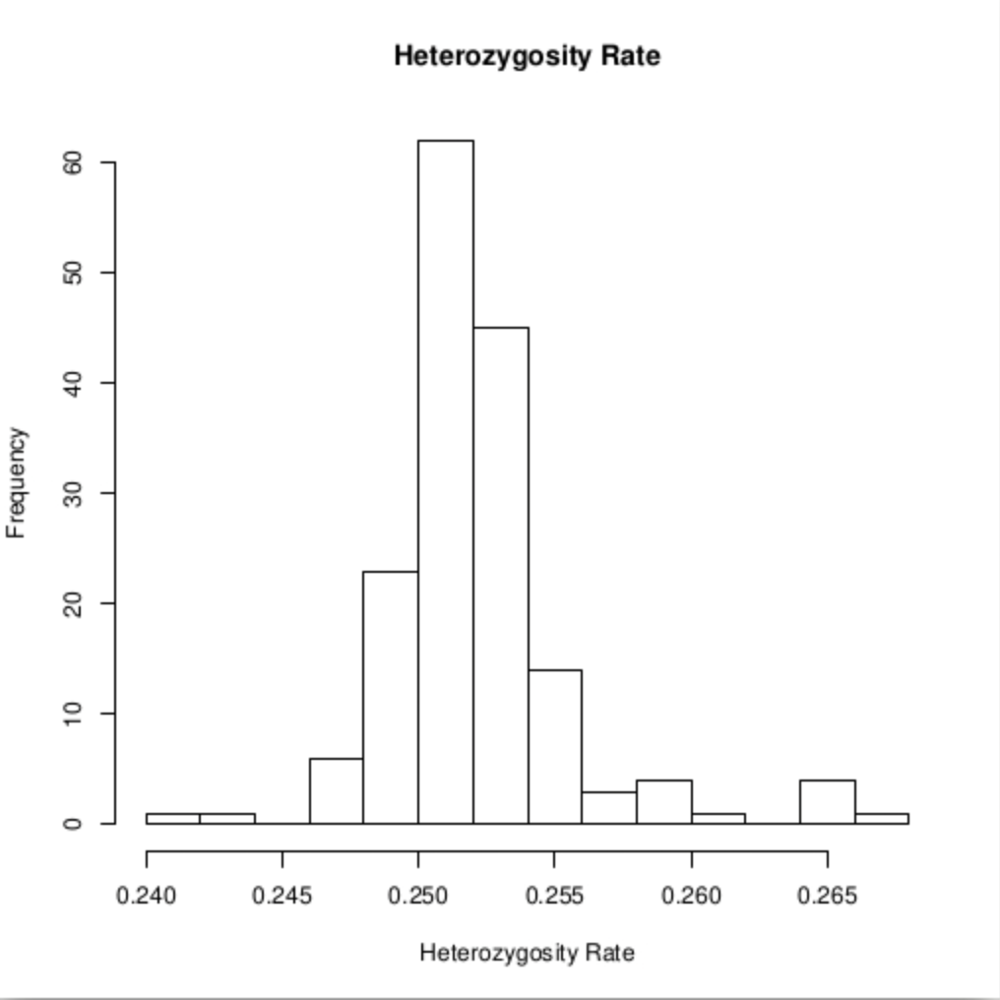

##### NAME - Ritika Reddy 
##### DATE - Feb 28 2024

# Lab7 

## TASK1 - Visualization of missingness results
#### 1- submission script 
-> The script missingnessPlot.sh is used to run the R script and generate the missingness plot. It helps SLURM scheduler known the parameters and run the ‘hist_miss.R’ script: 

-> Code: 
#!/bin/bash
#SBATCH --account=msbi32400
#SBATCH --time=00:30:00
#SBATCH --nodes=1
#SBATCH --ntasks-per-node=1
#SBATCH --mem-per-cpu=2000
#SBATCH --job-name=MissingnessPlot
#SBATCH --output=/home/ritika11/lab7/results/MissingnessPlot-%j.out
#SBATCH --error=/home/ritika11/lab7/results/MissingnessPlot-%j.err
module load R
Rscript --no-save /home/ritika11/lab7/src/hist_miss.R

#### 2 - The generated plots

####  3 - Description of Plots
##### A) Histogram  of SNP missingness 
-> There is a big peak at the left end that shows that a large number of SNP’s have a missingness rate closer to 0 
-> This indicates that data has great quality, and the SNP’s have a very low rate of missing data.     
-> This could mean that this SNP is reliable and can be further analyzed. 
##### B) Histogram  of Individual missingness 
-> There is a big peak at the left end that shows that a large number of SNP’s have a missingness rate closer to 0 
-> Very few individuals have a missingness rate above 0.005 
-> This indicates that data has great quality and is mostly complete in regards to individual genotype data. 

## TASK2 - Sex discrepancies

#### Description of Plots
-> Men Histogram - Men usually have an X and Y chromosome which could explain the high F-statistic. The plot also shows that most male samples have been identified correctly. This information can be given with the values be concentrated along 1.0
-> Women Histogram - Women usually have an X and X chromosome which could explain the lower F-statistic. Most values can be  concentrated along 0.
-> Gender Histogram - The gender histogram combines the data for the men and women. There are 2 peaks, 0 means woman and 1 means male. 

## TASK3 - Hardy Weinberg Equilibrium
-> Total Genotyping rate = 0.997378.

## TASK4 - Heterozygosity 

-> Number of removed variants - 1,291,657
-> Number of outliers - 7 

## TASK5 - Pihat
#### 1-pihat value 
-> 0.5654

#### 2-FID & IID
-> 1353 
-> NA12546 

## TASK7 - Commands
#### TASK 1 COMMANDS: 
- For the submission script :
  
#!/bin/bash
#SBATCH --account=msbi32400
#SBATCH --time=00:30:00
#SBATCH --nodes=1
#SBATCH --ntasks-per-node=1
#SBATCH --mem-per-cpu=2000
#SBATCH --job-name=MissingnessPlot
#SBATCH --output=/home/ritika11/lab7/results/MissingnessPlot-%j.out
#SBATCH --error=/home/ritika11/lab7/results/MissingnessPlot-%j.err
module load R
Rscript --no-save /home/ritika11/lab7/src/hist_miss.R

- To generate histograms :

module load R
Rscript --no-save /home/ritika11/lab7/src/hist_miss.R

#### TASK 2 COMMANDS: 
- To generate histograms :
module load R
Rscript --no-save /home/ritika11/lab7/src/gender_check.R

#### TASK 3 COMMANDS: 
- To find genotying rate:
plink --bfile /home/ritika11/lab7/data/HapMap_3_r3_1 --hardy --out /home/ritika11/lab7/data/HapMap_3_r3_1_hwe

#### TASK 4 COMMANDS: 
- To find number of removed variants:
plink --bfile /home/ritika11/lab7/data/HapMap_3_r3_1 --exclude /home/ritika11/lab7/data/inversion.txt --indep-pairwise 50 5 0.2 --out /home/ritika11/lab7/data/indepSNP
wc -l /home/ritika11/lab7/data/indepSNP.prune.out

- To find number of outliers:
Rscript --no-save /home/ritika11/lab7/src/heterozygosity_outliers_list.R
wc -l /home/ritika11/lab7/data/fail-het-qc.txt

- To generate plot
module load R
Rscript --no-save /home/ritika11/lab7/src/check_heterozygosity_rate.R

#### TASK 5 COMMANDS: 
- To find pihat value
awk '{if(NR>1) print $10}' /home/ritika11/lab7/data/pihat_min0.2.genome | sort -nr | head -1

- To find FID & IID of Individuals
awk '$10 == 0.5654 {print $1, $2}' /home/ritika11/lab7/data/pihat_min0.2.genome

